# ANALYZING HEALTH DATA OF MEDICAL STUDENTS 

## INTRODUCTION
This data set is presented to analyze the health of medical students. It is done to provide insight on the physical and medical status of students.
The dataset contains 200,000 rows and 16 columns of information.
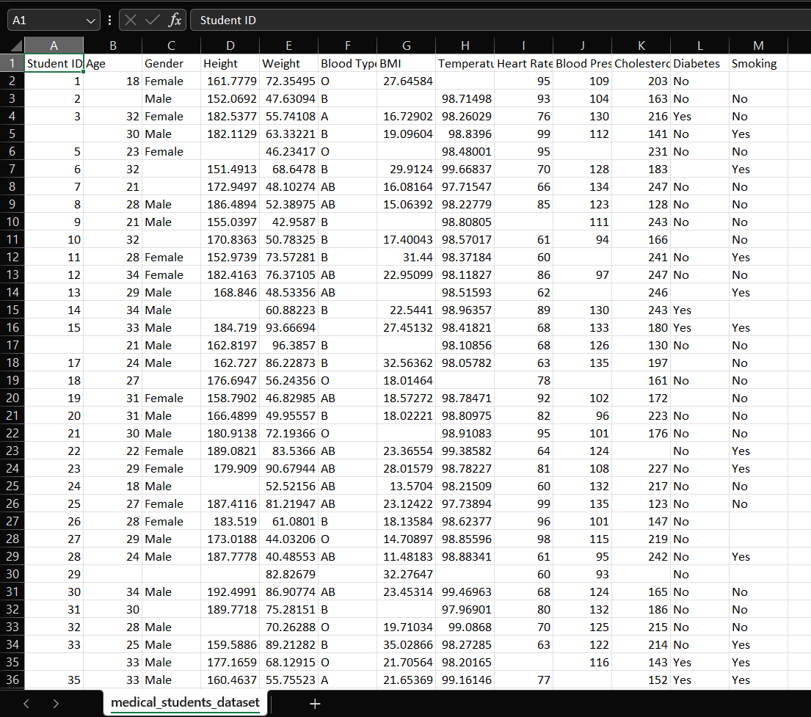
## PROBLEM STATEMENT
The data analysis is set to show the following:
1. Average values for the following for Male and Females (Age, BMI, Temperature, Heart Rate, Blood Pressure, and Cholesterol)
2. Average Height and Weight for both Genders (in 2 decimal places)
3. Number of students across the different Blood Groups
4. Number of Students who smoke and those who don’t
5. Number of Students who have diabetes and those who don’t

## DATA CLEANING
For the analysia process, I first started with cleaning the data set by doing the following 
1. Chaging the Data Type:
   I first changed the columns to the correct data types by using number format on the columns with numerical data. 
2. Filling in the Blanks:
   This data came with a lot of blanks that needed to be filled in.
- For the first column which was the student id, I noticed it was numbered 1 to 200000. Because of that, I created a new column and numbered it as usual from 1 to 200000 using flash fill. Then, I deleted the 
  original first column that came with the data set.
- For the numerical columns, I calculated the average and used that to fill in the blank spaces 
- For the gender and blood type column, I used the most occurring values which were FMALE and O respectively
- For the last two columns which were yes or no answers, I used not specified to fill in the columns.
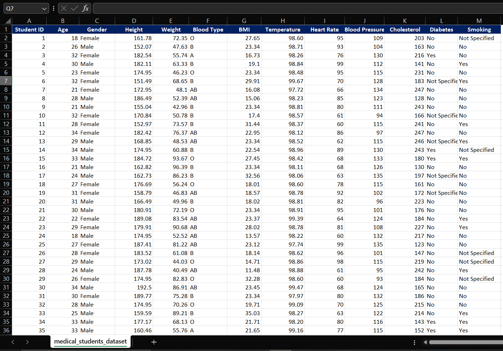
## ANALYZING THE DATA
To answer the questions, I used pivot tables an created charts 

### Average values for the following for Male and Females (Age, BMI, Temperature, Heart Rate, Blood Pressure, and Cholesterol)
- From this, it is seen that
  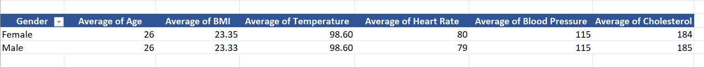
  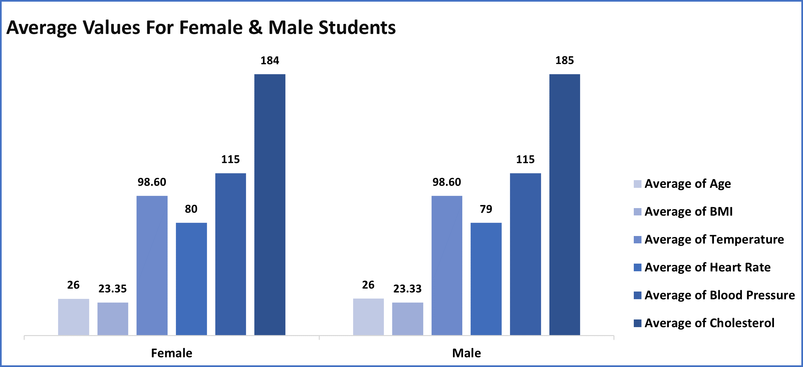

### Average Height and Weight for both Genders (in 2 decimal places)
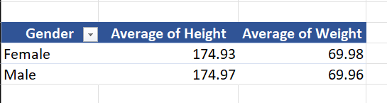
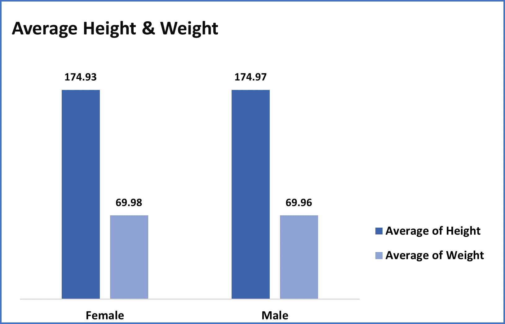

###  Number of students across the different Blood Groups
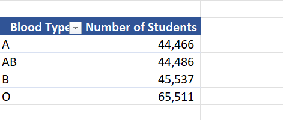
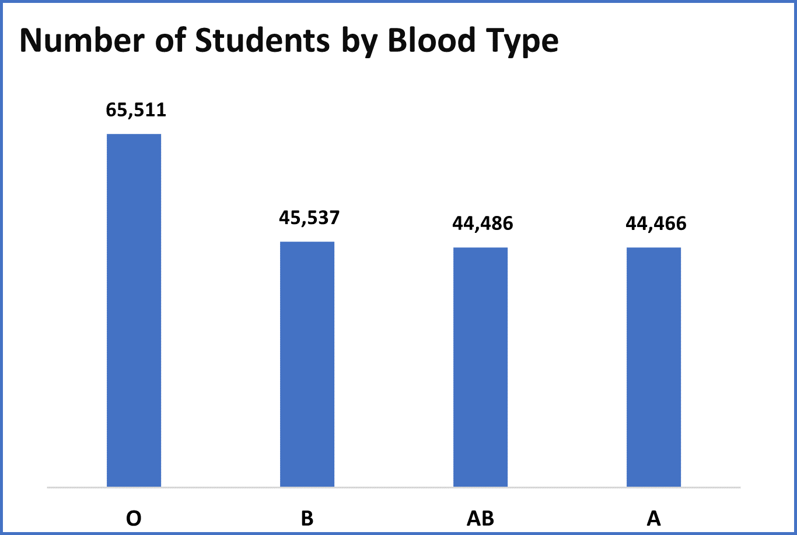

### Number of Students who smoke and those who don’t
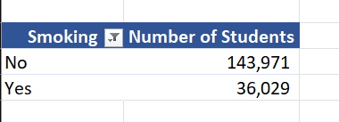
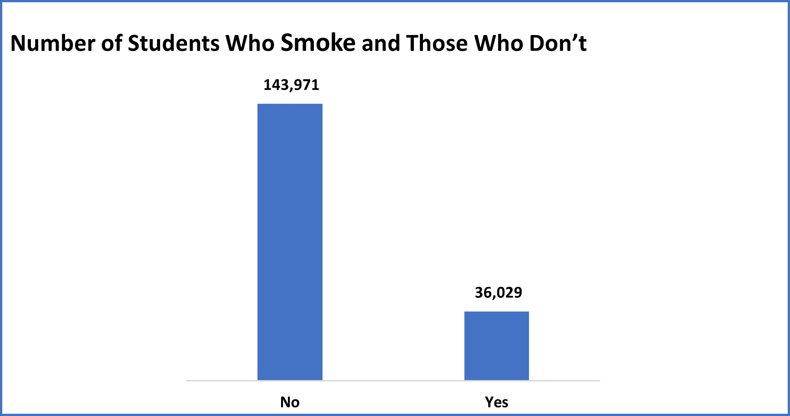

### Number of Students who have diabetes and those who don’t
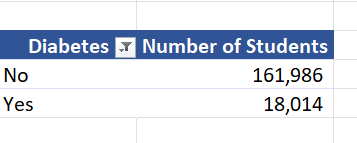
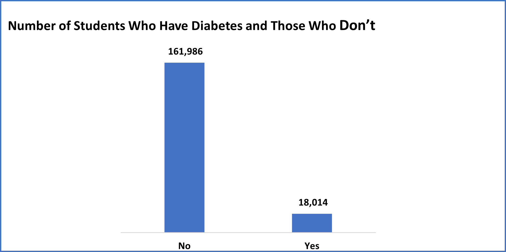
  
